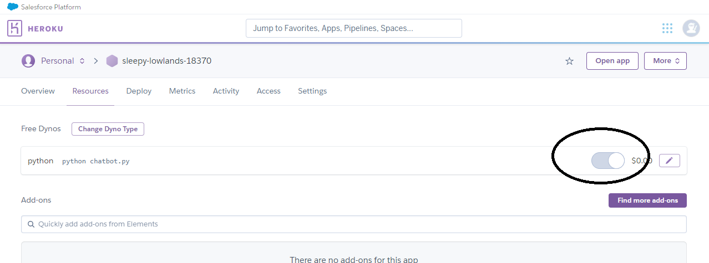

# COM7940 Cloud Computing 

## 2020/21 S2 Lab 5 Deploying the chatbot to Heroku


| | | |
|--|--|--|
| Instructor | Dr. Kevin Wang  | kevinw@comp.hkbu.edu.hk|
| Teaching Assistant | Mr. Zijian Lei | cszjlei@comp.hkbu.edu.hk |


**Objective:**
---
Throughout this lab you will be able to:
1. experience using a public cloud;


---


## 1. Registration

We are using Heroku in his lab. Go and apply a free account from Heroku. Unless you are really aware what you are doing, you should not give your credit card info to Heroku.

If you have previously applied a student account from GitHub, you can also claim the student pack from Heroku so that you can taste horizontal scaling. See more: https://www.heroku.com/github-students.


## Installing Heroku CLI

Throughout the deployment you will need Heroku CLI to work with. Install it here:
https://devcenter.heroku.com/categories/command-line.


---

## Deploy with Git


Continue with your existing code but make sure you have updated the `requirements.txt` to a correct version

```txt
telegram
python-telegram-bot>=13.1
configparser
redis
```

Add a file called `Procfile` (without .txt, first letter capitalized) to your folder. This file should contain:

```txt
python: python chatbot.py
```

This file `Procfile` simply tells Heroku that you need to run the code `chatbot.py`.

Now we need to create an app in Heroku. You can do it by clicking on Heroku after login. Alternatively you can do it with heroku cli. In this step you will be choosing your own app's name. Assume you call it `comp7940chatbot` (but you can't, I took it already).

Type the following in your local repo terminal:
```
$ heroku git:remote -a comp7940chatbot 
```

## **Then stage the file `Procfile` and push it to heroku master's branch.**

The step is intentionally skipped here. I believe you know how to do it.

You should see something like the following if you have done correctly.


Next, visit heroku and turn on your app.



Your app should be working if there is no problem. 

## Debugging

On dashboard, locate the button `More` at your top right corner, click on it > `View logs` and see what are the errors.

---

## Migrate to a securer version

It is rather unwise to leave your password with the developer. Thus, we need to change the code a little bit.

```py
import os
# import configparser

# ....
def main():
    # Load your token and create an Updater for your Bot
    
    # config = configparser.ConfigParser()
    # config.read('config.ini')
    updater = Updater(token=(os.environ['ACCESS_TOKEN']), use_context=True)
    dispatcher = updater.dispatcher

    global redis1
    redis1 = redis.Redis(host=(os.environ['HOST']), password=(os.environ['PWD']), port=(os.environ['REDISPORT']))
# ...
```

In such case the system configuration is read from Heroku's environment variable directly. Follow the instruction here: https://devcenter.heroku.com/articles/config-vars to setup the variable `ACCESS_TOKEN`, `HOST`, `PWD`, and `REDISPORT`.

Of course after changing your code, you need to push it back to heroku.